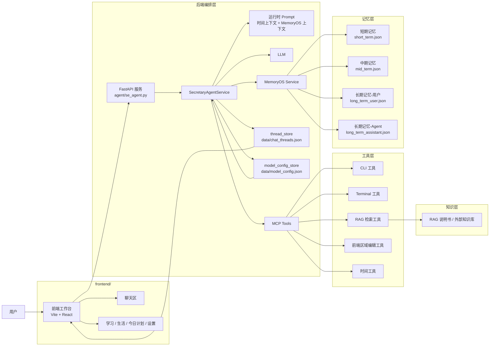

# Secretary Agent

一个面向“AI 秘书”场景的全栈项目。当前版本已经具备：

- `FastAPI` 后端对话服务
- `Vite + React + Tailwind CSS` 前端工作台
- 基于 `MemoryOS` 风格实现的短期 / 中期 / 长期记忆
- `MCP tools` 工具执行体系
- `RAG` 说明书检索能力
- 前端多会话、本地线程存储、流式回复、设置页热更新模型配置

项目目标不是做一个只会聊天的助手，而是做一个“能记忆、能调工具、能操作前端、能作为个人秘书长期协作”的系统。

## 整体架构



## 设计原则

### 1. RAG 只负责“说明书”

本项目里的 `RAG` 不负责存实时状态，也不代替数据库和命令执行。它的定位是“给 agent 查流程、规则、操作说明”。

也就是说：

- 问“怎么做、步骤是什么、规则是什么”时，适合先查 `RAG`
- 问真实状态、真实文件、真实数据库结果时，应该优先调用真实工具

### 2. MemoryOS 负责记忆

记忆分三层：

- `短期记忆`：最近进入记忆系统的原始问答
- `中期记忆`：由短期问答聚合出来的主题片段
- `长期记忆`：结构化画像 + knowledge 列表

长期记忆目前已经支持：

- `manual_profile`：手动维护的结构化画像
- `inferred_profile`：MemoryOS 自动归纳的结构化画像
- `merged_profile_text`：两者合并后最终注入模型的摘要
- `knowledge`：长期知识列表，用于检索兼容

### 3. thread_store 只负责前端会话恢复

前端多个对话页使用本地线程文件：

- [data/chat_threads.json](/Users/yz1/Learn/secretary_agent/data/chat_threads.json)

它只负责：

- 会话列表展示
- 历史消息恢复
- 删除本地会话记录

它**不等于**模型真正使用的长期记忆。

### 4. MCP tools 负责真实执行

当前 agent 不是通过“写死的 prompt”去完成一切，而是通过工具来执行真实动作，例如：

- 命令行执行
- 终端控制
- RAG 检索
- 前端局部编辑
- 时间查询

## 目录结构

```text
secretary_agent/
├── agent/                 # FastAPI 服务与 agent 主编排入口
├── frontend/              # Vite + React 前端工作台
├── se_mcp/                # 各类 MCP server
├── se_tools/              # MCP client 接入层
├── se_model/              # LLM 配置与实例化
├── se_prompts/            # system prompt 生成
├── utils/
│   ├── memoryos/          # MemoryOS 风格记忆实现
│   ├── thread_store.py    # 前端会话本地存储
│   ├── frontend_regions.py# 前端白名单区域注册
│   └── model_config_store.py
├── data/
│   ├── chat_threads.json  # 前端会话记录
│   ├── model_config.json  # 当前生效模型配置
│   └── memoryos/          # 记忆数据
├── knowledge_RAG/         # RAG 资料源（可上传外部知识库）
├── logs/                  # 运行日志
└── test/                  # 简单测试脚本
```

## 当前核心能力

### 对话与线程

- 支持多会话线程
- 支持流式回复
- 删除某个对话页时，只删除本地线程记录，不删除 MemoryOS 记忆
- 同一个用户的多个对话页，最终共享同一份长期记忆

### MemoryOS 记忆中心

- 短期记忆只读展示
- 中期记忆只读展示
- 长期记忆支持：
  - 用户画像结构化编辑
  - Agent 画像结构化编辑
  - 自动归纳画像展示
  - 合并后画像摘要展示

### 设置页

前端已经支持设置页，包含 4 个模块：

- 模型配置
- 短期记忆
- 中期记忆
- 长期记忆

模型配置支持在线热更新：

- `base_url`
- `api_key`
- `model_name`

保存后无需重启后端，新请求会自动使用新模型配置。

### 前端工作台

当前主界面包含：

- `今日计划`
- `学习`
- `生活`
- `设置`

其中：

- `学习` / `生活` 支持静默刷新按钮
- 静默刷新会触发 agent 在后台通过工具修改前端白名单区域
- 修改后会执行前端构建校验，失败自动回滚

## 启动方式

### 1. 安装 Python 依赖

推荐使用 `uv`：

```bash
uv sync
```

如果你已经有 `.venv`，也可以直接复用现有环境。

### 2. 安装前端依赖

```bash
cd /Users/yz1/Learn/secretary_agent/frontend
npm install
```

### 3. 启动后端

```bash
cd /Users/yz1/Learn/secretary_agent
./.venv/bin/python agent/se_agent.py
```

默认地址：

- 后端：[http://127.0.0.1:9826](http://127.0.0.1:9826)

### 4. 启动前端

```bash
cd /Users/yz1/Learn/secretary_agent/frontend
npm run dev
```

默认前端开发服务器会通过 Vite 代理把 `/api` 请求转发到：

- `http://127.0.0.1:9826`

## 环境变量

### 模型初始化相关

首次启动时，如果本地还没有 `data/model_config.json`，后端会优先参考环境变量初始化模型配置：

- `DASHSCOPE_API_KEY`

初始化后，实际生效配置会落盘到：

- [data/model_config.json](/Users/yz1/Learn/secretary_agent/data/model_config.json)

### RAG 检索相关

当前 RAG MCP 依赖以下环境变量：

- `ALIBABA_CLOUD_ACCESS_KEY_ID`
- `ALIBABA_CLOUD_ACCESS_KEY_SECRET`
- `WORKSPACE_ID`

## 主要接口

### 健康检查

- `GET /`

### 聊天接口

- `POST /`
- `POST /api/chat`
- `POST /stream`
- `POST /api/chat/stream`

### 线程管理

- `GET /api/chat/threads`
- `POST /api/chat/threads`
- `GET /api/chat/history?thread_id=...`
- `PATCH /api/chat/threads/{thread_id}`
- `DELETE /api/chat/threads/{thread_id}`

### 设置中心

- `GET /api/settings`
- `PUT /api/settings/model`
- `PUT /api/settings/long-term-profile`

### 面板静默刷新

- `POST /api/panel-refresh`

请求体示例：

```json
{
  "panel": "study"
}
```

## 数据文件说明

### 线程记录

- [data/chat_threads.json](/Users/yz1/Learn/secretary_agent/data/chat_threads.json)

只用于：

- 前端会话恢复
- 本地消息展示
- 删除/切换/草稿管理

### 模型配置

- [data/model_config.json](/Users/yz1/Learn/secretary_agent/data/model_config.json)

当前会保存：

- `base_url`
- `api_key`
- `model_name`

### MemoryOS 数据

用户侧：

- [short_term.json](/Users/yz1/Learn/secretary_agent/data/memoryos/users/default_user/short_term.json)
- [mid_term.json](/Users/yz1/Learn/secretary_agent/data/memoryos/users/default_user/mid_term.json)
- [long_term_user.json](/Users/yz1/Learn/secretary_agent/data/memoryos/users/default_user/long_term_user.json)

助手侧：

- [long_term_assistant.json](/Users/yz1/Learn/secretary_agent/data/memoryos/assistants/moss/long_term_assistant.json)

## 记忆与对话关系

这是当前项目最容易混淆的一点：

### 前端多个对话页是否共享记忆？

**是的。**

当前 MemoryOS 是按固定用户 `default_user` 维护的，因此：

- 不同 `thread_id` 的会话最终都会汇入同一份用户记忆
- 删除某个对话页，只会删本地会话记录
- 不会删除已经进入短期 / 中期 / 长期记忆的数据

### 对话历史是否会完整发给模型？

**不是。**

当前真正发给模型的是：

- 当前时间上下文
- 当前这次用户输入
- MemoryOS 检索出的相关记忆上下文

而不是把整个 `chat_threads.json` 全量塞进 prompt。

## 时间感知机制

为了避免 agent 没有成功调用时间工具时失去时间感，目前是双保险：

1. `system prompt` 中动态注入当前时间上下文  
2. 每次真正发给模型的消息体中，也显式嵌入当前时间上下文

同时仍然保留时间工具：

- `get_current_datetime`

## 当前 MCP 工具

### 命令执行

- `run_cli`

适合一次性真实操作，例如：

- 查询数据库
- 查看文件内容
- 执行轻量脚本

### 终端控制

- `open_new_terminal`
- `close_terminal_if_open`
- `get_terminal_full_text`
- `run_script_in_exist_terminal`
- `send_terminal_keyboard_key`

适合：

- 长任务
- 交互式任务
- 持续观察输出

### RAG 检索

- `retrieve_rag`

只用于查说明书，不用于代替真实执行。

### 前端白名单区域编辑

- `list_frontend_regions`
- `read_frontend_region`
- `update_frontend_region`
- `validate_frontend_region_change`

当前白名单区域包括：

- `sidebar-nav`
- `today-plan-panel`
- `study-panel`
- `life-panel`
- `settings-panel`

### 时间工具

- `get_current_datetime`

## 开发建议

### 改工具能力时

优先：

1. 新增 MCP 工具
2. 再补 RAG 说明书
3. 最后再考虑 prompt 层规则

### 改前端界面时

优先：

1. 使用前端白名单区域工具
2. 先读区域
3. 再更新区域
4. 最后做构建校验

### 改记忆结构时

优先保持这三层职责稳定：

- `thread_store`：前端会话恢复
- `MemoryOS`：记忆
- `RAG`：说明书

## 测试与校验

前端：

```bash
cd /Users/yz1/Learn/secretary_agent/frontend
npm run build
npm run lint
```

后端语法校验：

```bash
cd /Users/yz1/Learn/secretary_agent
./.venv/bin/python -m py_compile agent/se_agent.py
```

简单联调脚本：

- [test/qianduan.py](/Users/yz1/Learn/secretary_agent/test/qianduan.py)
- [test/houduan.py](/Users/yz1/Learn/secretary_agent/test/houduan.py)

## 当前状态说明

这个 README 是基于当前代码真实状态整理的，不是未来规划稿。后续如果你继续调整：

- 前端分区
- MemoryOS 字段
- MCP 工具清单
- RAG 接入方式

建议同步更新这份文档，尤其是“整体架构”“主要接口”“数据文件说明”这三节。
